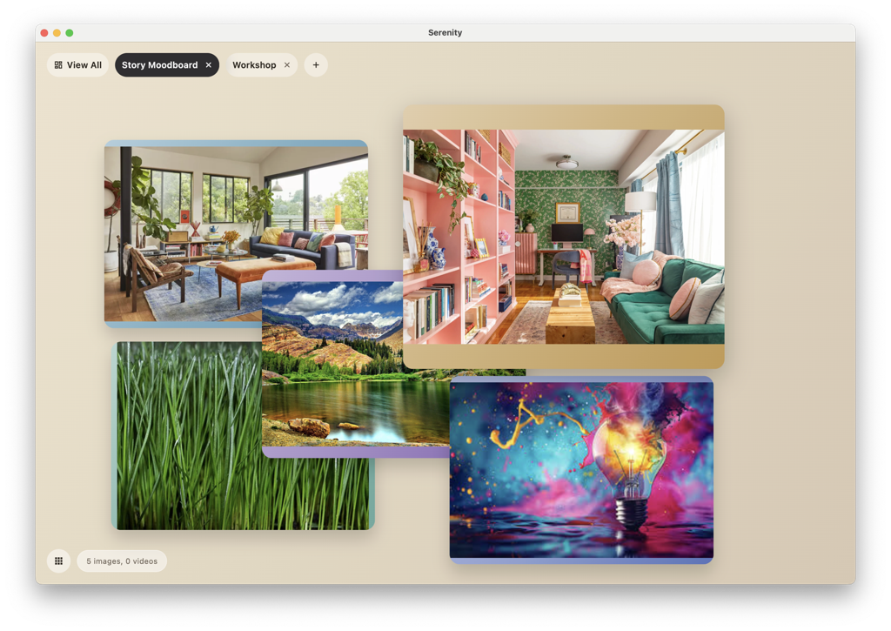

# Serenity

Serenity is a Flutter desktop media workspace for images and videos.

Instead of a traditional gallery grid, Serenity treats every asset like its own window inside a persistent desktop-style environment. You can move windows around, layer them, resize them, zoom into their contents, and organize them across multiple workspaces.



## What Serenity Does

- Opens images and videos as independent floating windows
- Supports overlapping windows with persistent positions, sizes, and z-order
- Lets you arrange assets into named workspaces
- Supports multiple pinned workspaces in a tab bar
- Saves window layout, zoom, scrub position, workspace order, and settings automatically
- Restores the last session on launch
- Imports assets through drag and drop or `File -> Open Assets...`
- Tracks assets by filename and md5
- Tries to relink missing files from known folders on load
- Exports and imports workspace environments as `.sry` files

## Current Desktop UX

Main workspace:
- Floating image and video windows
- Drag anywhere on a window to move it
- Resize from edges and corners
- Hover to reveal lightweight controls
- Video playback is muted by default

Window expose:
- Trigger with `Up Arrow`
- Rearranges all windows from the current workspace into a single wrapped view
- Preserves the same visible content region for zoomed assets
- Hover to reveal filename and close action

Workspace overview:
- Trigger with `Down Arrow`
- Shows the full workspace library
- Search by name
- Sort by pinned, recently viewed, recently created, or name

Top tab bar:
- `View All` tab
- Pinned workspace tabs
- Drag to reorder pinned tabs
- Close tab action to unpin
- `+` tab to create a new workspace

## Media Behavior

Images:
- Open in their own windows
- Preserve aspect ratio at all times
- Fit to the window by default
- Support zooming and panning inside the window

Videos:
- Open paused by default when a workspace loads
- Support play/pause
- Support scrubbing
- Persist playback position
- Are classified as short or long videos using a 2 minute cutoff

## Persistence

Serenity saves state automatically. That includes:

- workspaces
- pinned state and tab order
- window positions and sizes
- content zoom and pan
- video playback position
- asset metadata
- known folders
- load-limit settings

On macOS, the app is currently configured for normal filesystem access rather than sandboxed file access.

## `.sry` Environments

Serenity can save and load environments as `.sry` files.

An environment stores:

- workspace structure
- asset metadata and layout state
- settings
- workspace thumbnails

Media files themselves are not copied into the environment.

## Running Locally

Requirements:

- Flutter
- macOS toolchain for the current desktop target

Commands:

```bash
flutter pub get
flutter run -d macos
```

Useful checks:

```bash
flutter analyze
flutter test
```

## Project Notes

- Main application code currently lives in `lib/main.dart`
- The desktop target is macOS-first
- The app icon is generated from `logo.png`

## Status

Serenity is an active prototype with a strong macOS desktop workflow already in place. The codebase currently prioritizes the desktop workspace experience over broad cross-platform polish.
